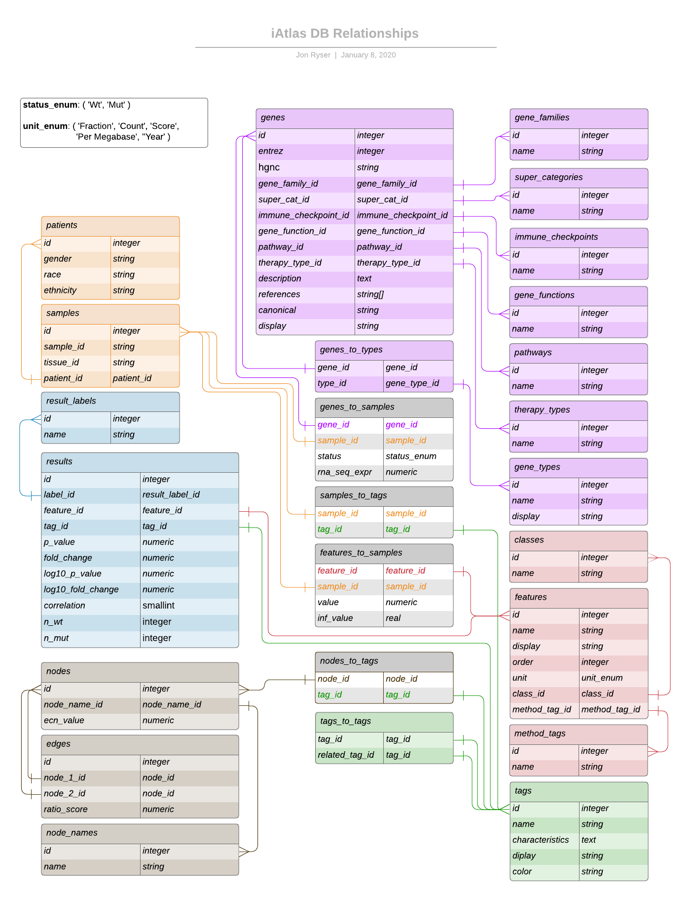

# iAtlas Data Model

The data used in the iAtlas application is tabular data currently stored in a PostgreSQL database. There are script within the project that can automate ghetting data into the database. For this script to work effectively, there are some data conventions that must be followed. This document will outline those conventions.

Please see the diagram at the bottom of this document for a visualization. [Click here to go to the diagram](#data-model-diagram)

## Enums

The database makes use of a couple enumerables. These "enums" are built into the database when it is built and help ensure consistency in some data fields.

The available enums are:

- ### DIRECTION_ENUM

  `( 'Amp', 'Del' )`

  This enum represents the direction of a node. Amp = Amplified, Del = Deleted

- ### STATUS_ENUM

  `( 'Wt', 'Mut' )`

  This enum represents the status of a gene. Wt = Wild Type, Mut = Mutant

- ### UNIT_ENUM

  `( 'Fraction', 'Count', 'Score', 'Per Megabase', ''Year' )`

  This enum represents the unit used for the value of the relationship between features.

## Main Data Tables

The data is organized into several "main" data tables. These tables hold data describing specific entities. The data in a specific table should never be aware of how it is being used in another table.

The main tables are:

- ### genes

  Each row describes an individual gene. The genes are primarily identified by [Entrez Id](http://bioportal.bioontology.org/ontologies/EDAM?p=classes&conceptid=data_1027) and secondarily by [HGNC Symbol](https://registry.identifiers.org/registry/hgnc.symbol).
  
- ### datasets

  Each row describes an individual dataset.

- ### patients

  Each row describes an individual patient.

- ### features

  Each row describes an individual feature.

- ### tags

  Each row describes and individual tag.

  Tags may be used to associate entities. For example, a number of individual samples may be associated with the "TCGA_Study" tag. Further, a number of tags may be with a tag like "TCGA_Study". this allows the entities associated with the initial tags to utlimately be associated with "TCGA_Study" through the initial tags. Instead of thinking of "groups", we can think of tags. This tagging allows us to create groups and hierarchies by association.

- ### driver_results

  Each row describes an individual driver result.

- ### copy_number_results

  Each row describes an individual copy number result.

- ### nodes

  Each row describes an individual node. A node is the relataionship of a gene with a specific tag to the same gene with a different tag or tags.

  Currently, the only value represented is the extra cellular network (ecn_value). Moving forward, other values may be added as new columns.

- ### edges

  Each row describes an individual edge. An edge is a relationship between two [nodes](#nodes).

## Sub Tables

There are many sub tables. These tables contain data that is typically related to a main table. As the information withing the sub table is duplicated many times within the rows of a main table, it makes sense to relate that data in a separate sub table so that it may be better indexed. This also uses the power of the database itself to ensure consistency of these values and helps prevent duplication through human typos.

The sub tables are:

- ### [Patients](#patients) Sub Tables

  - ### samples

    Each row describes an individual bio sample.

  - #### slides

    Each row describes an individual slide.

- ### [Genes](#genes) Sub Tables

  - #### gene_families

    Each row describes an individual gene family.

  - #### gene_functions

    Each row describes an individual gene function.

  - #### gene_types

    Each row describes an individual gene type. The current gene types are "immunomodulator", "io_target", and "extra_cellular_network".

  - #### immune_checkpoints

    Each row describes an individual immune checkpoint.

  - #### node_types

    Each row describes an individual node type.

  - #### mutations

    Each row describes a mutation which is a relationship between a gene, a mutation code, and a mutation type.

  - #### mutation_codes

    Each row describes an individual mutation code.

  - #### mutation_types

    Each row describes an individual mutation type.

  - #### pathways

    Each row describes an individual pathway.

  - #### super_categories

    Each row describes an individual super category.

  - #### therapy_types

    Each row describes an individual therapy type.

- ### [Features](#features) Sub Tables

  - #### classes

    Each row describes an individual class.

  - #### method_tags

    Each row describes an individual method tag.

## Relational (Join) Tables

Much of the data has a one to many or many to many relationship. Rather than have that data expressed in the main tables or sub tables as array structures or similar which would be challenging (and slow) to access, these relationships are kept in join tables that simply hold the ids of the related data. This also makes it indexable as fast integers.

The relational (join) tables are:

- ### datasets_to_samples

  Each row describes a dataset to sample relationship.
  
- ### datasets_to_tags

  Each row describes a dataset to tag relationship.

- ### genes_to_samples

  Each row describes a gene to sample relationship.

  For example, "Gene A" may be related to "Sample A". That would be one row. "Gene B" may also be related to "Sample A". That would be an additional row. "Gene A" may also be related to "Sample B". That would be yet again another row, and so on.

  Each row also holds the RNA Sequence Expression of this realtionship.

- ### samples_to_mutations

  Each row describes a sample to mutation relationship.

  For example, "Sample A" may be related to the mutation relationship "Mutation A". That would be one row. "Sample A" may also be related to the mutation relationship "Mutation B". That would be an additional row. "Sample B" may also be related to the mutation relationship "Mutation A". That would be yet again another row, and so on.

  Each row also holds the status of this realtionship, being either "Wt" (Wild Type) or "Mut" (Mutant) - ([STATUS_ENUM](#STATUS_ENUM)).

- ### genes_to_types

  Each row describes a gene to gene type relationship.

  For example, "Gene A" may be related to "Type 1". That would be one row. "Gene B" may also be related to "Type 1". That would be an additional row. "Gene A" may also be related to "Type 2". That would be yet again another row, and so on.

- ### tags_to_tags

  Each row describes a tag to tag relationship. This table is for adding semantic information to tags. It can be used to group tags. It is useful to think of it in this way:

  - `related_tag` _has-a_ `tag`
  - e.g. `TGCA` _has-a_ `ACC`

  For example, "Good Tag" may be related to "Parent Tag". That would be one row. "Great Tag" may also be related to "Parent Tag". That would be an additional row. "Good Tag" may also be related to "Sub Tag". That would be yet again another row, and so on.

- ### samples_to_tags

  Each row describes a sample to tag relationship.

  For example, "Sample 1" may be related to "Good Tag". That would be one row. "Sample 2" may also be related to "Good Tag". That would be an additional row. "Sample 1" may also be related to "Sub Tag". That would be yet again another row, and so on.

- ### features_to_samples

  Each row describes a feature to sample relationship.

  For example, "Feature A" may be related to "Sample 1". That would be one row. "Feature B" may also be related to "Sample 1". That would be an additional row. "Feature A" may also be related to "Sample 2". That would be yet again another row, and so on.

- ### nodes_to_tags

  Each row describes a node to tag relationship.

  For example, "Node 1" may be related to "Good Tag". That would be one row. "Node 2" may also be related to "Good Tag". That would be an additional row. "Node 1" may also be related to "Great Tag". That would be yet again another row, and so on.

- ### edges_to_tags

  Each row describes an edge to tag relationship.

  For example, "Edge 1" may be related to "Good Tag". That would be one row. "Edge 2" may also be related to "Good Tag". That would be an additional row. "Edge 1" may also be related to "Great Tag". That would be yet again another row, and so on.

## Table Fields

The fields in each table represent a specific property of the entities represented by the table.

For example, in the genes table, the fields are properties specifically of a gene. The gene is not aware of the sample it comes from and is not aware of any tag it is associated with. App specific information about the gene should not be contained in the data. If we imagine using this data in many different applications, we see that only data that is specific to the actual gene should be in the gene table.

The following are descriptions of each field in each table. This should be exhaustive.

- [datasets](#dataset)

  - `id` - A unique database identifier for the specific dataset. This is an integer that is generated by the database. (an integer)
  
  - `name` - The unique name of the dataset. (a string)

  - `display` - A display name for the dataset. (a string)
  
- [datasets_to_samples](#datasets_to_samples)

  - `dataset_id` - The database identifier of a specific dataset. Relates to the `id` field in a row in the [datasets](#datsets) table. (an integer)

  - `sample_id` - The database identifier of a specific sample. Relates to the `id` field in a row in the [samples](#samples) table. (an integer)
  
- [datasets_to_tags](#datasets_to_tags)

  - `dataset_id` - The database identifier of a specific dataset. Relates to the `id` field in a row in the [datasets](#datsets) table. (an integer)

  - `tag_id` - The database identifier of a specific tag. Relates to the `id` field in a row in the [tags](#tags) table. (an integer)
  
- [genes](#genes)

  - `id` - A unique database identifier for the specific gene. This is an integer that is generated by the database. (an integer)

  - `entrez` - The unique Entrez Id for this gene. (an integer)

  - `hgnc` - The unique HUGO Id (HGNC Symbol) for this gene. (a string)

  - `description` - A text description of the gene. (a string)

  - `friendly_name` - A human friendly name for the gene. (a string)

  - `gene_family_id` - The database identifier of the gene family associated with this gene. Relates to the `id` field in a row in the [gene_families](#gene_families) sub table. (an integer)

  - `gene_function_id` - The database identifier of the gene function associated with this gene. Relates to the `id` field in a row in the [gene_functions](#gene_functions) sub table. (an integer)

  - `immune_checkpoint_id` - The database identifier of the immune checkpoint associated with this gene. Relates to the `id` field in a row in the [immune_checkpoints](#immune_checkpoints) sub table. (an integer)

  - `io_landscape_name` - A string that represents the genes specific io landscape name. (a string)

  - `node_type_id` - The database identifier of the node type associated with this gene. Relates to the `id` field in a row in the [node_types](#node_types) sub table. (an integer)

  - `pathway_id` - The database identifier of the pathway associated with this gene. Relates to the `id` field in a row in the [pathways](#pathways) sub table. (an integer)

  - `super_cat_id` - The database identifier of the super category associated with this gene. Relates to the `id` field in a row in the [super_categories](#super_categories) sub table. (an integer)

  - `therapy_type_id` - The database identifier of the therapy type associated with this gene. Relates to the `id` field in a row in the [therapy_types](#therapy_types) sub table. (an integer)

  - `references` - An array of URLs related to this gene. (an array of string)

- [gene_family](#gene_family)

  - `id` - A unique database identifier for the specific gene family. This is an integer that is generated by the database. (an integer)

  - `name` - The unique name of the gene family. (a string)

- [gene_function](#gene_function)

  - `id` - A unique database identifier for the specific gene function. This is an integer that is generated by the database. (an integer)

  - `name` - The unique name of the gene function. (a string)

- [gene_types](#gene_types)

  - `id` - A unique database identifier for the specific gene type. This is an integer that is generated by the database. (an integer)

  - `name` - The unique name of the gene type. (a string)

  - `display` - A human friendly name for the gene type. (a string)

- [immune_checkpoints](#immune_checkpoints)

  - `id` - A unique database identifier for the specific immune checkpoint. This is an integer that is generated by the database. (an integer)

  - `name` - The unique name of the immune checkpoint. (a string)

- [node_types](#node_types)

  - `id` - A unique database identifier for the specific node type. This is an integer that is generated by the database. (an integer)

  - `name` - The unique code of the node type. (a string)

- [pathways](#pathways)

  - `id` - A unique database identifier for the specific pathway. This is an integer that is generated by the database. (an integer)

  - `name` - The unique name of the pathway. (a string)

- [super_categories](#super_categories)

  - `id` - A unique database identifier for the specific super category. This is an integer that is generated by the database. (an integer)

  - `name` - The unique name of the super category. (a string)

- [therapy_types](#therapy_types)

  - `id` - A unique database identifier for the specific therapy type. This is an integer that is generated by the database. (an integer)

  - `name` - The unique name of the therapy type. (a string)

- [mutation_types](#mutation_types)

  - `id` - A unique database identifier for the specific mutation type. This is an integer that is generated by the database. (an integer)

  - `name` - The unique name of the mutation type. (a string)

  - `display` - A human friendly name for the mutation type. (a string)

- [mutation_codes](#mutation_codes)

  - `id` - A unique database identifier for the specific mutation code. This is an integer that is generated by the database. (an integer)

  - `code` - The unique code for the mutation code. (a string)

- [genes_to_types](#genes_to_types)

  - `gene_id` - The database identifier of a specific gene. Relates to the `id` field in a row in the [genes](#genes) main table. (an integer)

  - `type_id` - The database identifier of a specific gene type. Relates to the `id` field in a row in the [gene_types](#gene_types) sub table. (an integer)

- [mutations](#mutations)

  - `id` - A unique database identifier for the specific mutation. This is an integer that is generated by the database. (an integer)

  - `gene_id` - The database identifier of a specific gene. Relates to the `id` field in a row in the [genes](#genes) main table. (an integer)

  - `mutation_code_id` - The database identifier of a specific mutation code. Relates to the `id` field in a row in the [mutation_codes](#mutation_codes) sub table. (an integer)

  - `mutation_type_id` - The database identifier of a specific mutation type. Relates to the `id` field in a row in the [mutation_types](#mutation_types) sub table. (an integer)

- [patients](#patients)

  - `id` - A unique database identifier for the specific patient. This is an integer that is generated by the database. (an integer)

  - `barcode` - The unique barcode identifier assigned for this patient. (a string)

  - `ethnicity` - The ethnicity of the patient. (a string)

  - `gender` - The gender of the patient. (a string)

  - `height` - The height of the patient. (a string)

  - `race` - The race of the patient. (a string)

  - `age` - The age of the patient. (a string)

  - `weight` - The weight of the patient. (a string)

- [samples](#samples)

  - `id` - A unique database identifier for the specific sample. This is an integer that is generated by the database. (an integer)

  - `name` - The unique name or barcode for the specific sample. (a string)

  - `patient_id` - The unique patient id for the specific sample. This is the patient that the sample is derived from. Relates to the `id` field in a row in the [patients](#patients) main table. (an integer)

- [slides](#slides)

  - `id` - A unique database identifier for the specific sample. This is an integer that is generated by the database. (an integer)

  - `name` - The unique name of the slide. The name should be built according to the schema define at [https://docs.gdc.cancer.gov/Encyclopedia/pages/TCGA_Barcode/](https://docs.gdc.cancer.gov/Encyclopedia/pages/TCGA_Barcode/). (a string)

  - `description` - A text description of the sample. (a string)

  - `patient_id` - The database identifier of a specific patient. This is the patient the sample is derived from. Relates to the `id` field in a row in the [patients](#patients) main table. (an integer)

- [genes_to_samples](#genes_to_samples)

  - `gene_id` - The database identifier of a specific gene. Relates to the `id` field in a row in the [genes](#genes) main table. (an integer)

  - `sample_id` - The database identifier of a specific sample. Relates to the `id` field in a row in the [samples](#samples) sub table. (an integer)

  - `rna_seq_expr` - The RNA Sequence Expresion of the gene and sample in this relationship. (a numeric value)

- [samples_to_mutations](#samples_to_mutations)

  - `gene_id` - The database identifier of a specific gene. Relates to the `id` field in a row in the [genes](#genes) main table. (an integer)

  - `sample_id` - The database identifier of a specific sample. Relates to the `id` field in a row in the [samples](#samples) sub table. (an integer)

  - `mutation_code_id` - The database identifier of a specific mutation code. Relates to the `id` field in a row in the [mutation_codes](#mutation_codes) sub table. (an integer)

  - `status` - The status of the gene in this relationship. May be a value from the [STATUS_ENUM](#STATUS_ENUM). (a STATUS_ENUM)

- [driver_results](#driver_results)

  - `id` - A unique database identifier for the specific driver result. This is an integer that is generated by the database. (an integer)

  - `gene_id` - The database identifier of a specific gene. Relates to the `id` field in a row in the [genes](#genes) main table. (an integer)

  - `feature_id` - The database identifier of a specific feature. Relates to the `id` field in a row in the [features](#features) main table. (an integer)

  - `tag_id` - The database identifier of the specific tag associated with this driver result. Relates to the `id` field in a row in the [tags](#tags) main table. (an integer)

  - `mutation_code_id` - The database identifier of the specific mutation code associated with this driver result. Relates to the `id` field in a row in the [mutation_codes](#mutation_codes) sub table. (an integer)

  - `p_value` - The p value of the driver result. (a numeric value)

  - `log10_p_value` - The log base 10 representation of the p value of the driver result. (a numeric value)

  - `fold_change` - The fold change of the driver result. (a numeric value)

  - `log10_p_fold_change` - The log base 10 representation of the fold change of the driver result. (a numeric value)

  - `n_wt` - The number of wild type genes in the driver result. (an integer)

  - `n_mut` - The number of mutant genes in the driver result. (an integer)

- [copy_number_results](#copy_number_results)

  - `id` - A unique database identifier for the specific copy number result. This is an integer that is generated by the database. (an integer)

  - `gene_id` - The database identifier of a specific gene. Relates to the `id` field in a row in the [genes](#genes) main table. (an integer)

  - `feature_id` - The database identifier of a specific feature. Relates to the `id` field in a row in the [features](#features) main table. (an integer)

  - `tag_id` - The database identifier of the specific tag associated with this copy number result. Relates to the `id` field in a row in the [tags](#tags) main table. (an integer)

  - `direction` - The direction of the copy number result. (a DIRECTION_ENUM)

  - `mean_normal` - The mean normal value of the copy number result. (a numeric value)

  - `mean_cnv` - The mean cnv value of the copy number result. (a numeric value)

  - `p_value` - The p value of the copy number result. (a numeric value)

  - `log10_p_value` - The log base 10 representation of the p value of the copy number result. (a numeric value)

  - `t_stat` - The t stat value the copy number result. (a numeric value)

- [features](#features)

  - `id` - A unique database identifier for the specific feature. This is an integer that is generated by the database. (an integer)

  - `name` - The unique name for the specific feature. (a string)

  - `display` - A human friendly name for the feature. (a string)

  - `order` - The priority of the feature. This may be used to display features in order. (an integer)

  - `unit` - The priority of the feature. This may be used to display features in order. (a UNIT_ENUM)

  - `class_id` - The database identifier of the specific class associated with this feature. A class may NOT be empty. Relates to the `id` field in a row in the [classes](#classes) sub table. (an integer)

  - `method_tag_id` - The database identifier of the specific method tag associated with this feature. Relates to the `id` field in a row in the [method_tags](#method_tags) sub table. (an integer)

- [classes](#classes)

  - `id` - A unique database identifier for the specific class. This is an integer that is generated by the database. (an integer)

  - `name` - The unique name for the specific class. (a string)

- [method_tags](#method_tags)

  - `id` - A unique database identifier for the specific method tag. This is an integer that is generated by the database. (an integer)

  - `name` - The unique name for the specific method tag. (a string)

- [tags](#tags)

  - `id` - A unique database identifier for the specific tag. This is an integer that is generated by the database. (an integer)

  - `name` - The unique name for the specific tag. The name field may be used as a friendly short display in some cases or as a canonical for headings in other cases. (a string)

  - `display` - A human friendly name for the tag. The display field may be used as a friendly long display in some cases or left empty and unused in other cases. (a string)

  - `characteristics` - Characteristic details of the tag. (a string)

  - `color` - The [hex triplet](https://en.wikipedia.org/wiki/Web_colors#Hex_triplet) of a color associated with the tag. (a string)

- [tags_to_tags](#tags_to_tags)

  - `tag_id` - The database identifier of a specific tag. Relates to the `id` field in a row in the [tags](#tags) main table. (an integer)

  - `related_tag_id` - The database identifier of a specific tag that is related to the tag represented by the `tag_id` value. Relates to the `id` field in a row in the [tags](#tags) main table. (an integer)

- [samples_to_tags](#samples_to_tags)

  - `sample_id` - The database identifier of a specific sample. Relates to the `id` field in a row in the [samples](#samples) sub table. (an integer)

  - `tag_id` - The database identifier of a specific tag. Relates to the `id` field in a row in the [tags](#tags) main table. (an integer)

- [features_to_samples](#features_to_samples)

  - `sample_id` - The database identifier of a specific sample. Relates to the `id` field in a row in the [samples](#samples) sub table. (an integer)

  - `feature_id` - The database identifier of a specific feature. Relates to the `id` field in a row in the [features](#features) main table. (an integer)

  - `value` - The feature value related to this specific sample. (a numeric value)

  - `inf_value` - If a value (from the "value" column) is infinity (Inf or -Inf), the value is stored in this column. (a real value) This is using an approach similar to [https://stackoverflow.com/a/45603066](https://stackoverflow.com/a/45603066)

- [nodes](#nodes)

  - `id` - A unique database identifier for the specific node. This is an integer that is generated by the database. (an integer)

  - `gene_id` - The database identifier of a specific gene. Relates to the `id` field in a row in the [genes](#genes) main table. (an integer)

  - `feature_id` - The database identifier of a specific feature. Relates to the `id` field in a row in the [features](#features) main table. (an integer)

  - `label` - The label of the specific node. (a string)

  - `score` - The score (value) of the specific node. (an integer)

  - `x` - The initial "x" position of the specific node. (a number)

  - `y` - The initial "y" of the specific node. (a number)

- [nodes_to_tags](#nodes_to_tags)

  - `node_id` - The database identifier of a specific node. Relates to the `id` field in a row in the [nodes](#nodes) main table. (an integer)

  - `tag_id` - The database identifier of a specific tag. Relates to the `id` field in a row in the [tags](#tags) main table. (an integer)

- [edges](#edges)

  - `id` - A unique database identifier for the specific edge. This is an integer that is generated by the database. (an integer)

  - `node_1_id` - The database identifier of a specific node. Relates to the `id` field in a row in the [nodes](#nodes) main table. (an integer)

  - `node_2_id` - The database identifier of a specific node. Relates to the `id` field in a row in the [nodes](#nodes) main table. (an integer)

  - `label` - The label of the specific edge. (a string)

  - `score` - The relationship value between the two nodes. (an integer)

- [edges_to_tags](#edges_to_tags)

  - `edge_id` - The database identifier of a specific edge. Relates to the `id` field in a row in the [edges](#edges) main table. (an integer)

  - `tag_id` - The database identifier of a specific tag. Relates to the `id` field in a row in the [tags](#tags) main table. (an integer)

## Data Structure

Information on the data structure can be found in the `feather_files` folder which contains this [README.md](../feather_files/README.md#iatlas-data-structures) markdown file.

## Data Model Diagram

